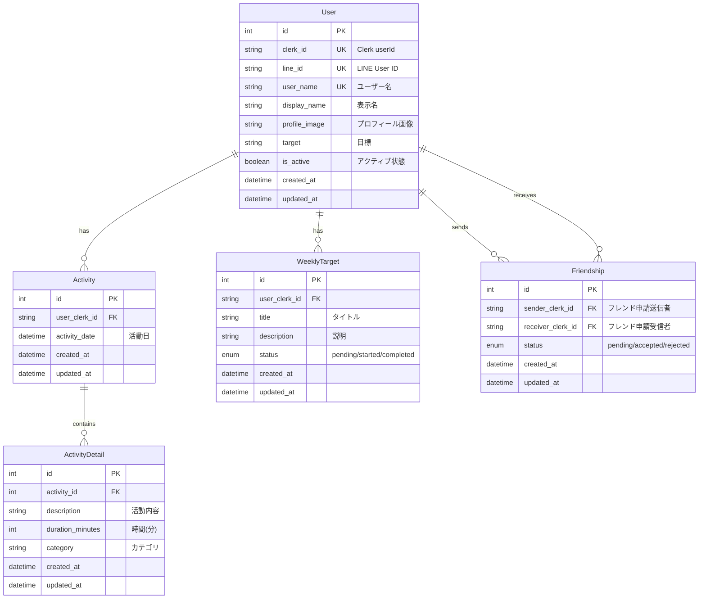

# ActiveLink - 習慣促進SNS

## 🚀 デモ

**[ActiveLink](https://active-link-frontend.vercel.app)** - デプロイされたアプリをお試しいただけます

画面右上の「**ゲストログイン**」ボタンを押下することでゲストユーザーとしてログインできます。

## 📝 概要

ActiveLinkは**友達と習慣形成を促進し合えるSNSアプリケーション**です。

ユーザーは日々の活動を記録し、週次目標を設定して継続的な習慣作りをサポートします。友達とのつながりを通じてお互いの活動を共有し、モチベーションを高め合うことができます。

### 🎯 主な価値提案
- **習慣の可視化**: 日々の活動を記録・分析
- **ソーシャルサポート**: 友達との励まし合い
- **継続的なモチベーション**: 進捗管理と目標達成
- **リアルタイム通知(任意)**: リアルタイムに友達の活動をLineで通知が受け取れる

## 📱 機能一覧

#### 📊 活動記録・管理
- 日々の活動記録（時間・内容・カテゴリ）
- 活動データの可視化（カレンダー・グラフ）

#### 🎯 目標設定・進捗管理
- 週次目標の設定
- 進捗状況の追跡（未開始・進行中・完了）
- 達成率の可視化

#### 👥 ソーシャル機能
- 友達申請・承認システム
- 友達の活動確認
- フレンドシップ管理

#### 📱 LINE通知機能（オプション）
- LINE公式アカウント連携
- 友達の活動開始時に自動通知
- リアルタイムでのモチベーション向上

### 🔄 今後追加予定
- 習慣継続ストリーク表示
- 達成バッジ・リワード機能
- コミュニティ機能

## 🖼️ スクリーンショット

### 活動記録(カレンダー)

### 活動時間(グラフ)

### 週次目標

### フレンド機能

### フレンド申請状況

## 📱 LINE API連携

### 🎉 友達の活動をリアルタイム通知

Lineのアカウントと連携することで、**友達が活動を開始した際に公式アカウントから自動でメッセージを受け取る**ことができます。

#### 特徴
- **Messaging API**を使用したリアルタイム通知
- **Clerk認証**との連携でセキュアな実装
- **友達関係の確認**後に通知送信
- **プライバシー配慮**した通知内容

#### 通知例

#### 設定手順
1. アカウント設定画面でLINEのアカウントを連携
2. 公式アカウントを友だち追加
3. テストメッセージでメッセージを送り設定完了
4. 友達の活動開始時にリアルタイムでメッセージを受信

## 🛠️ 技術スタック

### フロントエンド
| 技術 | 用途 |
|------|------|
| **Next.js** | Reactフレームワーク |
| **React** | UIライブラリ |
| **TypeScript** | 型安全性 |
| **Tailwind CSS** | スタイリング |
| **Shadcn/UI** | UIコンポーネント |
| **Lucide React** | アイコンライブラリ |
| **Recharts** | データ可視化 |
| **FullCalendar** | カレンダー機能 |

### バックエンド
| 技術 | 用途 |
|------|------|
| **Hono.js** | 軽量Webフレームワーク |
| **Prisma** | ORM・データベースアクセス |
| **Supabase** | PostgreSQLホスティング |
| **Zod** | スキーマバリデーション |

### インフラ・認証
| 技術 | 用途 |
|------|------|
| **Clerk** | ユーザー認証・管理 |
| **Vercel** | ホスティング・デプロイ |
| **Bun** | パッケージマネージャー |

### 外部API
| API | 用途 |
|-----|------|
| **LINE Messaging API** | 通知機能 |
| **LINE Login API** | アカウント連携 |

## 🗄️ データベース設計

**ActiveLink**で友達と一緒に新しい習慣を始めませんか？ 💪

[🔗 アプリを試す](https://active-link-frontend.vercel.app) | [🐛 Issue報告](https://github.com/renokazaki/active-link/issues) | [💬 Discussion](https://github.com/renokazaki/active-link/discussions)
