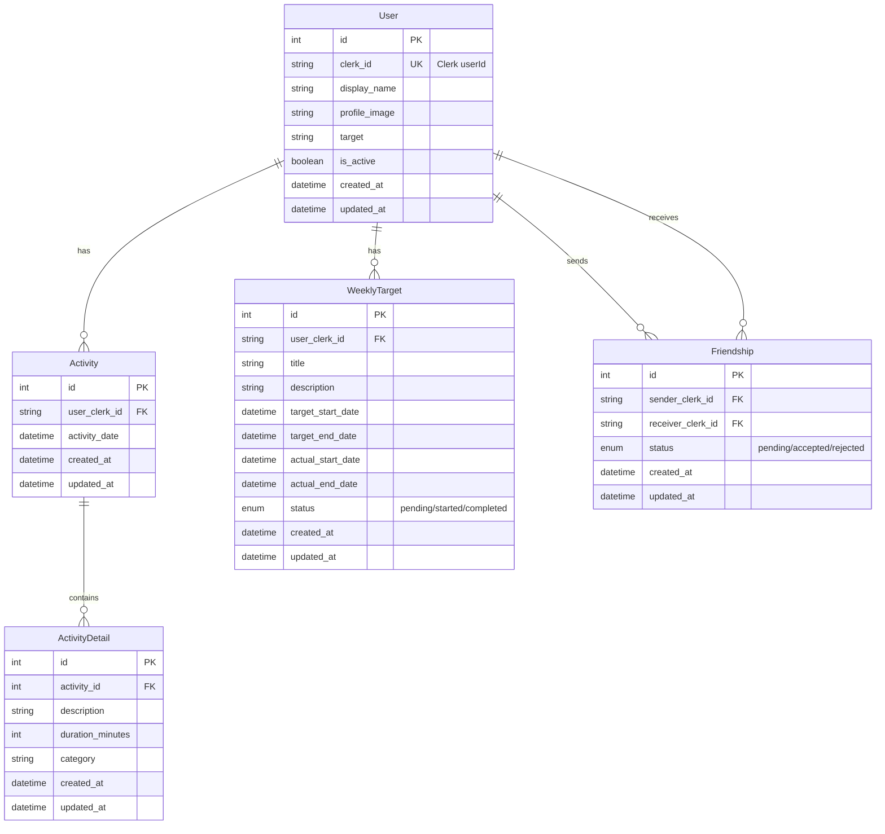

# 習慣促進SNS

## デモ
[ActiveLink](https://active-link-frontend.vercel.app)

リンクからデプロイされたアプリをお試しいただけます。
画面右上の「ゲストログイン」ボタンを押下することでゲストユーザーとしてログインできます。

## 概要

このアプリは友達と習慣形成を促進し合えるSNSアプリケーションです。
ユーザーは日々の活動を記録し、週次目標を設定して継続的な習慣作りをサポートします。
友達とのつながりを通じてお互いの活動を共有し、モチベーションを高め合うことができます。

主な機能として、活動の記録と詳細管理、カテゴリ別の活動分類、週次目標の設定と進捗管理、友達申請とフレンドシップ機能、活動の可視化とレポート機能を提供しています。

## 今後追加検討の機能

- Line連携をするとLineAPIを使用して友達が活動を行うと公式アカウントで通知が確認できる機能
- 習慣継続のストリーク表示
- 達成バッジやリワード機能

## 使用技術

### フロントエンド
- **Next.js 15**: Reactフレームワーク
- **React 19**: UIライブラリ
- **TypeScript**: 型安全性
- **Tailwind CSS**: スタイリング
- **Shadcn/UI**: UIコンポーネント
- **Lucide React**: アイコンライブラリ
- **Recharts**: データ可視化
- **FullCalendar**: カレンダー機能

### パッケージマネージャー
- **Bun**: 高速なパッケージマネージャー

### バックエンド
- **Hono.js**: 軽量Webフレームワーク
- **Prisma**: ORM
- **Supabase**: データベース（PostgreSQL）
- **Zod**: スキーマバリデーション
- **Svix**: Webhook処理

### 認証・デプロイ
- **Clerk**: ユーザー認証機能
- **Vercel**: ホスティング・デプロイ

### 外部API
- **LINE Bot SDK**: LINE通知機能（予定）

## テーブルのモデル

## 主な機能

### ユーザー管理
- Clerkを使用した認証機能
- プロフィール管理（表示名、プロフィール画像、目標設定）
- アクティブ状態の管理

### 活動記録
- 日々の活動を記録
- 活動時間の記録（分単位）
- 活動内容の詳細説明

### 週次目標
- 週単位での目標設定
- ステータス管理（未開始・進行中・完了）

### ソーシャル機能
- 友達申請・承認システム
- フレンドシップの状態管理
- 友達の活動確認機能

### データ可視化
- 活動データのグラフ表示
- 進捗状況の可視化
- カレンダー形式での活動履歴表示
